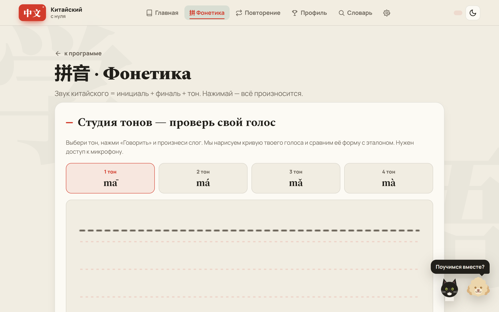
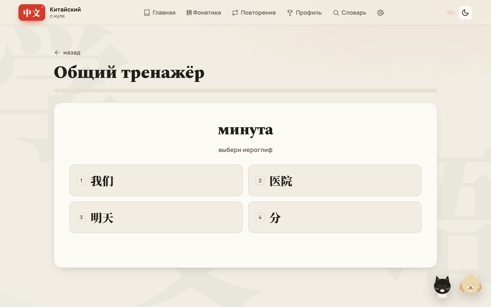
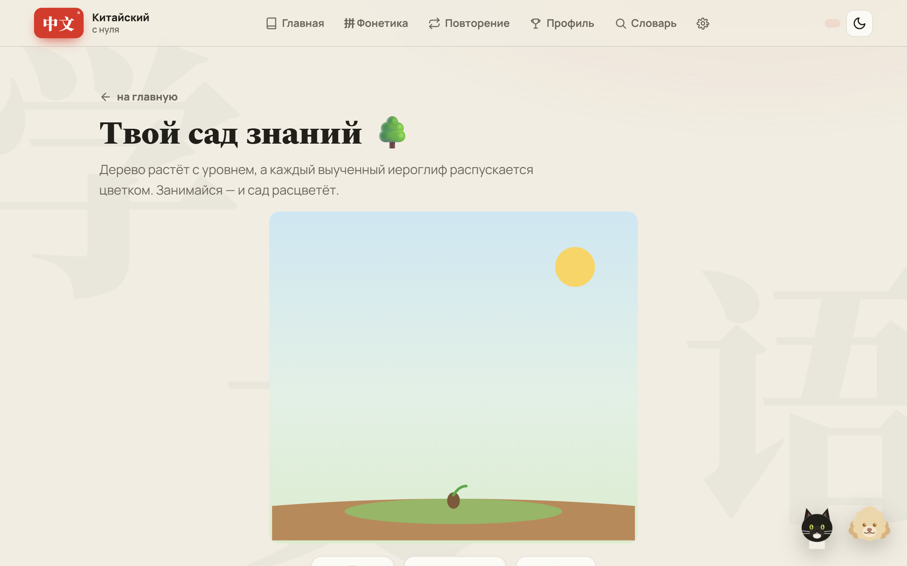
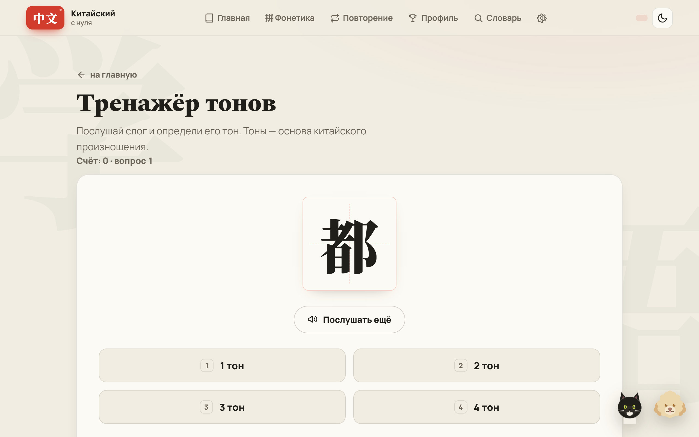

# 中文 · Тренажёр китайского языка (HSK 1)

Веб-приложение для изучения китайского с нуля до полного HSK 1: 150 слов, озвучка, двенадцать режимов тренировок и питомец, который болеет за тебя.

**[Открыть живую версию](https://escapist001.github.io/chinese/)** — работает в браузере, ставится как приложение и не требует интернета после первой загрузки.

## Что это и зачем

Всё началось с подарка близкому человеку, который учит китайский. Сначала это была простая страница с карточками. Потом захотелось добавить звук, потом прогресс, потом — чтобы работало в метро без связи. В итоге вышло полноценное PWA с полным словарём HSK 1 и геймификацией.

Задача у приложения одна: чтобы заниматься было не скучно и было понятно, куда двигаться дальше. Отсюда и структура из юнитов и уроков вместо бесконечной ленты слов.

## Как выглядит

| Фонетика: студия тонов с анализом голоса | Тренажёр слов |
|:---:|:---:|
|  |  |
| **Пропись 书法: пишешь иероглиф сам** | **Сад знаний** |
|  |  |
| **Тренажёр тонов** | |
|  | |

## Возможности

**Обучение**
- Полный словарь HSK 1: 10 юнитов, 30 уроков, 150 слов.
- 405 аудиофайлов с живым произношением.
- Двенадцать режимов тренировок: карточки, аудирование, диктант и другие.
- Интерактивная пропись 书法: обводишь иероглиф пальцем или мышью, движок проверяет каждую черту и подсказывает после ошибок.
- Этимология иероглифов — откуда взялся знак и почему он так выглядит.

**Геймификация**
- Питомец-компаньон (кошка или собака на выбор) реагирует на успехи словами поддержки.
- «Сад знаний» — прогресс, который растёт вместе со словарным запасом.
- Печенье с предсказанием и генератор китайского имени.

**Интерфейс**
- Плавные переходы между экранами (View Transitions API), появление секций при прокрутке, лёгкий наклон карточек за курсором.
- Чернильные брызги, лепестки сакуры, анимация порядка черт — эффекты в духе каллиграфии, без сторонних библиотек.
- Тема день/ночь. Всё уважает `prefers-reduced-motion`.
- Мобильная вёрстка в приоритете: основной сценарий — телефон.

## Стек

- Ванильный JavaScript, без фреймворков.
- HTML и CSS.
- PWA: service worker и manifest.json.
- Хостинг — GitHub Pages.

## Что интересного под капотом

- **Модульная ваниль.** Код разбит на `js/core`, `js/data`, `js/views` плюс отдельные `app.js` и `components.js`. Без сборщика и фреймворка это дисциплинирует: границы между слоями держатся на договорённостях, а не на инструментах.
- **Офлайн в первую очередь.** Service worker работает по стратегии network-first: онлайн отдаёт свежую версию, офлайн — кэш. Без сети приложение работает полностью.
- **Версионирование кэша.** При выкладке новой версии старый кэш вычищается, и пользователь не застревает на устаревших файлах — на статическом хостинге это единственный способ управлять обновлениями.
- **405 аудиофайлов.** Вся озвучка — реальные mp3, а не браузерный синтез. Организовать, подключить и раздавать такой объём статики оказалось отдельной задачей.

## Запуск локально

Это статический сайт, сборка не нужна.

```bash
git clone https://github.com/escapist001/chinese.git
cd chinese
python -m http.server 8000
```

Открыть `http://localhost:8000`. Подойдёт любой статический сервер. Можно открыть и просто `index.html`, но service worker заработает только по http.
